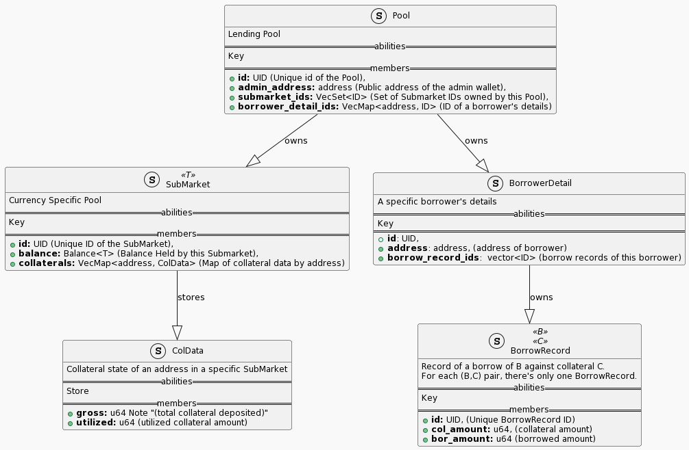

# Mala Protocol
Mala aims to be the go-to money market and autonomous credit protocol for the SUI ecosystem. It can become the foundation for a new DeFi ecosystem of not just on-chain products but of real world use cases for the next billion crypto consumers.

The Mala Protocol has four primary components.

### Mala Bank
Capital efficient autonomous bank. Both individual users and smart-contract protocols in the SUI ecosystem can lend and borrow assets here. The bank will follow an algorithm based on Control Theory to set dynamic interest rates. That ensures greater capital efficiency than regular DeFi money markets.

### Mala Credit Bureau
Credit protocol for the future: non-custodial, transparent, algorithmic, and community-governed. The bureau calculates credit ratings of users and protocols based on their activity with the [Mala Bank](https://hackmd.io/@bidhan/H1cR7eFxi#Mala-Bank). Borrow/supply interest rates, eligibility for under-collateralized loans, etc., are derived algorithmically from the score. The [Mala Council](https://hackmd.io/@bidhan/H1cR7eFxi#Mala-Council) selects the scoring algorithm(s) from a marketplace of open source algorithms.

### Mala Council
The council comprises users with staked Mala tokens who participate in governance, earn protocol fees and backstop certain protocol risks.

### Mala KYC DAO
Governed by the [Mala council](https://hackmd.io/@bidhan/H1cR7eFxi#Mala-Council). Mala KYC DAO incentivizes consumers to provide their real-world identity & credit info via secure & privacy-preserving entities trusted by the Mala council. This KYC information enables Mala to work as a trusted KYC provider for the SUI ecosystem for both DeFi and non-DeFi use cases (e.g. social media). The DAO also unlocks real-life use cases like institutions accepting a user's on-chain Mala credit score to provide lines of credit.

# The Vision
### Under Collateralized Loans
Backed by the Mala KYC DAO and corresponding credit score from the [Mala Credit Bureau](https://hackmd.io/@bidhan/H1cR7eFxi#Mala-Credit-Bureau), [Mala Bank](https://hackmd.io/@bidhan/H1cR7eFxi#Mala-Bank) will provide under or non-collateralized DeFi loans. Unlocking one of the biggest blockers of DeFi ecosystem becoming mainstream. Imagine credit cards backed by on-chain identity and credit providers!
### DeFi Protocol of Choice
Mala aims to build the leading DeFi & Credit protocol for the SUI ecosystem and real-world consumers, becoming the lender, credit and identity provider of choice for both consumers and smart-contract dApps.

# Why SUI
The vision of SUI ecosystem of not just providing on-chain use cases but real-world utility for the next billion users is in-line with the vision for Mala Protocol. The object-pool-centric design of SUI enables complex DeFi use cases never implemented before. The extra secure design of the Move Language will make the Mala Protocol ecosystem more resilient to potential vulnerabilities.

# Class Diagram

---

***Author: Bidhan Roy. In some roles in my career, I led KYC/Identity team for Cash App, ML infra team for Amazon Alexa & Instacart. Currently, I lead the ecosystem engineering initiatives for decentralized storage protocol Arweave.***
